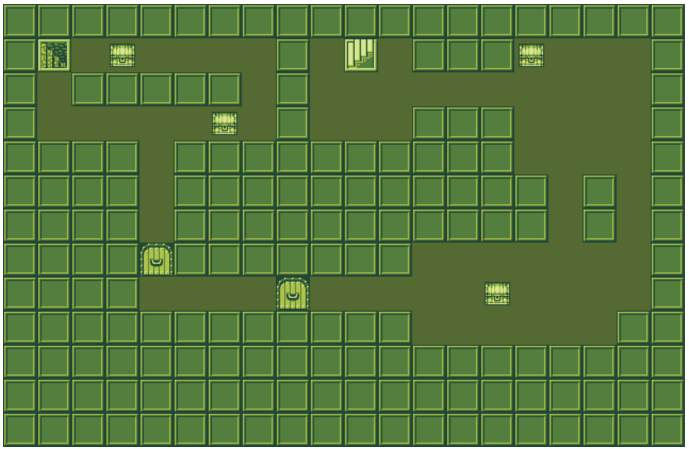
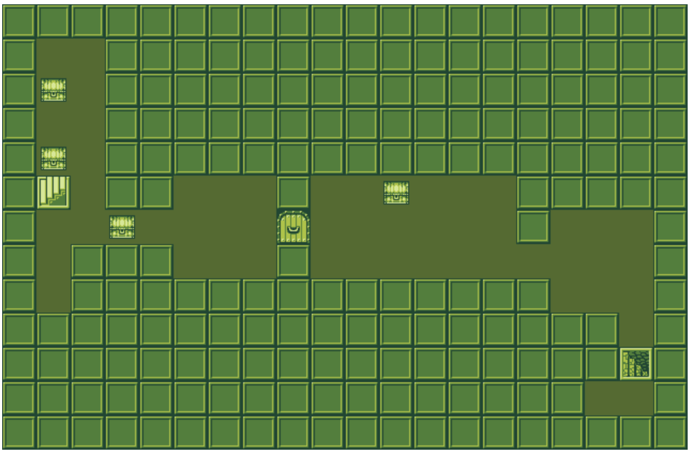
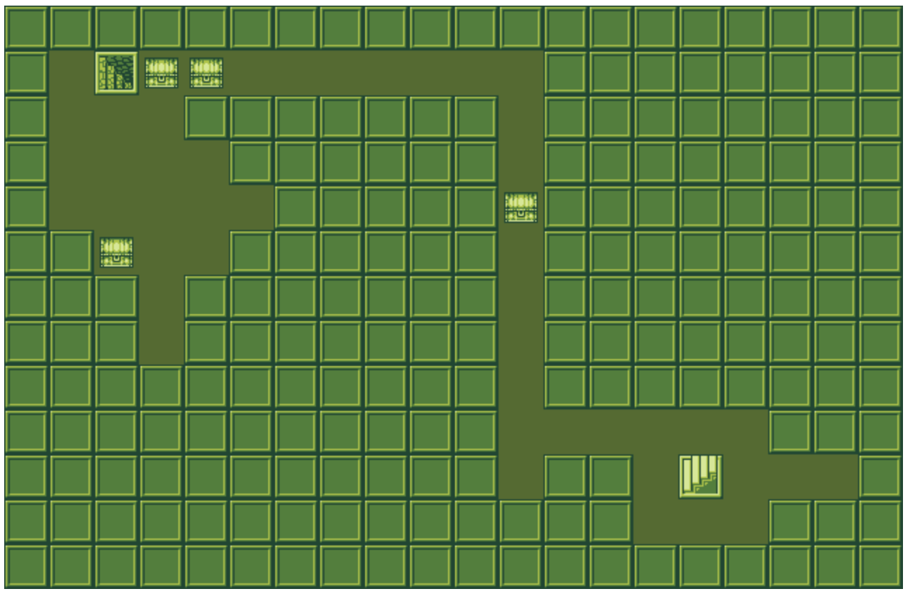

# Dungeon Array Creator

Returns a ready made dungeon based on settings.

To use level creator to return a 2D 'dungeon' array:

`dungeonLvl = new CreateDungeonLvl`

Default settings:
```
width: 20
height: 13
maximum hall length: 15
number of added halls: 30
halls up to the maximum length: true
chance of 3x3 room being created: 30%
chance of door being created when available: 10%
total number of items: 4
```

Change defaults:

`dungeonLvl = new CreateDungeonLvl(15, 15, 10, 40, false, 40, 15, 8)`

creates a dungeon level 15x15, maximum hall length of 10, 40 halls in total, halls will always be 10 in length (not up to but only 10 in length), 40% chance of 3x3 room created on an square (chance on squares where room can fit available), 15% chance of door created where available, 8 items are randomly added on empty squares

Array numbers:
```
0 = empty
1 = wall
2 = door
3 = item
4 = entrance
5 = exit
```


Notes:
- The edges of the dungeon are all enclosed
- Percentage chances based on available spots for room and doors (eg. doors need wall either side of them on one axis and empty on either side of the other axis to be created)
- No items/halls/rooms/entrance or exit will spawn on the dungeon edges
- Once one hall is created it chooses a random direct to create another, because of this it may go back on itself
- Currently if an item is added it can be overwritten with an exit or entrance

#### Example of array in use

copy path and file name of `index.html` in the browser

Example screen shots below:

 

 

 
